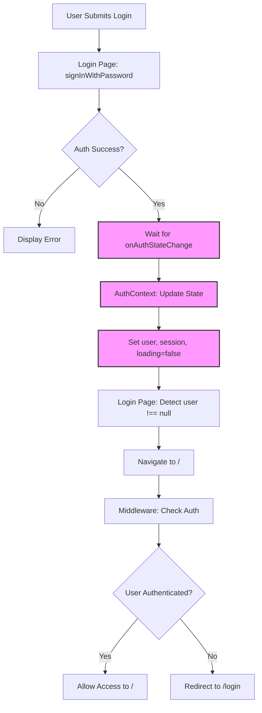
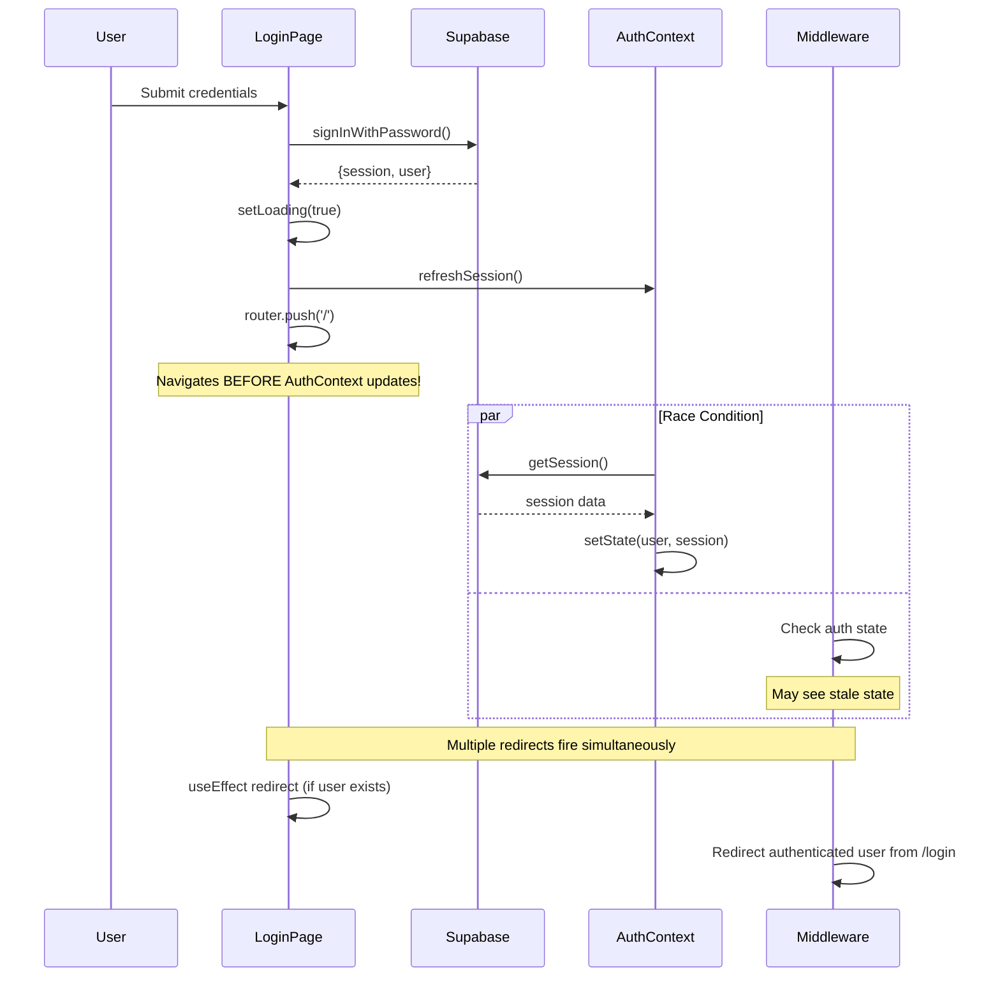
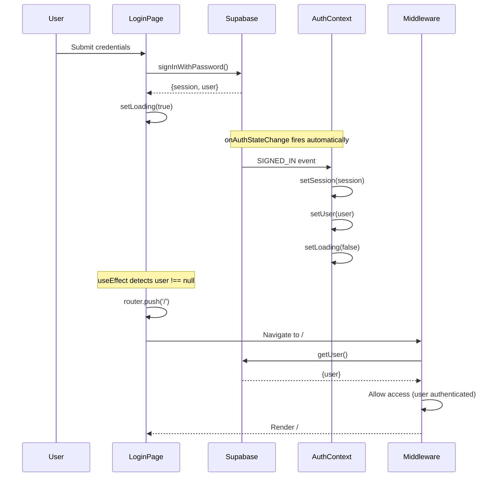

# Design Document: Authentication Flow Fix

## Overview

This design addresses critical race conditions and synchronization issues in the Next.js 16 Setra app's authentication flow using Supabase. The current implementation suffers from multiple competing redirect sources, loading state management issues, and timing problems between the login page, AuthContext, and middleware. This fix establishes a single source of truth for authentication state and eliminates race conditions by coordinating state updates and navigation timing.

The solution focuses on three key changes: (1) removing duplicate auth checks from the login page, (2) ensuring AuthContext state updates complete before navigation, and (3) preventing middleware redirect loops by properly handling authentication state transitions.

## Architecture



## Sequence Diagrams

### Current Problematic Flow



### Fixed Flow



## Components and Interfaces

### Component 1: AuthContext

**Purpose**: Single source of truth for authentication state across the application

**Interface**:
```typescript
interface AuthContextType {
  user: User | null;
  session: Session | null;
  loading: boolean;
  signOut: () => Promise<void>;
  refreshSession: () => Promise<void>;
}
```

**Responsibilities**:
- Initialize auth state on mount via `getSession()`
- Subscribe to `onAuthStateChange` events from Supabase
- Maintain synchronized user and session state
- Provide loading state to prevent premature renders
- Handle sign out and session refresh operations

**Changes Required**:
- Remove retry logic from `getSession()` (unnecessary complexity)
- Ensure `loading` is set to `false` after initial session check completes
- Keep `onAuthStateChange` subscription for real-time updates

### Component 2: Login Page

**Purpose**: Handle user authentication via email/password

**Interface**:
```typescript
interface LoginPageState {
  email: string;
  password: string;
  loading: boolean;
  error: string | null;
}
```

**Responsibilities**:
- Collect user credentials
- Call Supabase `signInWithPassword()`
- Display loading state during authentication
- Show error messages on failure
- Navigate to home page after successful authentication

**Changes Required**:
- **REMOVE** the `useEffect` that redirects if user exists (causes race condition)
- **REMOVE** the call to `refreshSession()` after login (unnecessary - `onAuthStateChange` handles this)
- **REMOVE** `router.refresh()` call (causes unnecessary re-render)
- **KEEP** `setLoading(true)` during login attempt
- **ADD** logic to wait for `authLoading === false` before checking user state
- **SIMPLIFY** redirect logic: only redirect after `user !== null` AND `authLoading === false`

### Component 3: Middleware

**Purpose**: Protect routes and redirect unauthenticated users

**Interface**:
```typescript
interface MiddlewareConfig {
  matcher: string[];
}

async function middleware(request: NextRequest): Promise<NextResponse>
```

**Responsibilities**:
- Check authentication state on every request
- Redirect unauthenticated users to `/login`
- Redirect authenticated users away from `/login` and `/signup`
- Maintain session cookies

**Changes Required**:
- **NO CHANGES NEEDED** - middleware logic is correct
- Middleware already uses `getUser()` which is the proper server-side auth check
- Redirect logic is sound: unauthenticated → `/login`, authenticated on auth pages → `/`

## Data Models

### AuthState

```typescript
interface AuthState {
  user: User | null;
  session: Session | null;
  loading: boolean;
}
```

**Validation Rules**:
- `user` and `session` must be synchronized (both null or both present)
- `loading` must be `true` during initial mount and `false` after first session check
- `session` must contain valid JWT token when present

### LoginFormState

```typescript
interface LoginFormState {
  email: string;
  password: string;
  loading: boolean;
  error: string | null;
}
```

**Validation Rules**:
- `email` must be valid email format
- `password` must be non-empty
- `loading` must be `true` during API call, `false` otherwise
- `error` must be `null` on success, error message string on failure

## Algorithmic Pseudocode

### Main Authentication Flow

```pascal
ALGORITHM handleUserLogin(credentials)
INPUT: credentials of type {email: String, password: String}
OUTPUT: navigation to home page OR error message

BEGIN
  ASSERT credentials.email IS valid email format
  ASSERT credentials.password IS non-empty string
  
  // Step 1: Set loading state
  setLoading(true)
  setError(null)
  
  // Step 2: Attempt authentication
  result ← supabase.auth.signInWithPassword(credentials)
  
  IF result.error EXISTS THEN
    setError(result.error.message)
    setLoading(false)
    RETURN
  END IF
  
  // Step 3: Wait for AuthContext to update via onAuthStateChange
  // (No explicit action needed - Supabase triggers the listener automatically)
  
  // Step 4: Keep loading=true to prevent UI flashing
  // Navigation will happen via useEffect when user state updates
  
  ASSERT result.session IS NOT null
  ASSERT result.user IS NOT null
END
```

**Preconditions**:
- Supabase client is initialized
- User is not already authenticated
- Email and password are provided

**Postconditions**:
- On success: `loading` remains `true`, AuthContext will update, navigation will occur
- On failure: `loading` is `false`, error message is displayed
- No race conditions between state updates and navigation

**Loop Invariants**: N/A (no loops in this algorithm)

### AuthContext Initialization

```pascal
ALGORITHM initializeAuthContext()
INPUT: none
OUTPUT: initialized auth state

BEGIN
  // Step 1: Set initial loading state
  setLoading(true)
  
  // Step 2: Fetch current session
  sessionResult ← supabase.auth.getSession()
  
  IF sessionResult.error EXISTS THEN
    console.error(sessionResult.error)
    setSession(null)
    setUser(null)
  ELSE IF sessionResult.session EXISTS THEN
    setSession(sessionResult.session)
    setUser(sessionResult.session.user)
  ELSE
    setSession(null)
    setUser(null)
  END IF
  
  // Step 3: Mark loading complete
  setLoading(false)
  
  // Step 4: Subscribe to auth state changes
  subscription ← supabase.auth.onAuthStateChange(handleAuthStateChange)
  
  RETURN cleanup function that unsubscribes
END
```

**Preconditions**:
- Supabase client is available
- Component is mounted

**Postconditions**:
- Auth state is initialized with current session
- `loading` is set to `false`
- Subscription to auth changes is active
- Cleanup function is returned for unmount

**Loop Invariants**: N/A

### Auth State Change Handler

```pascal
ALGORITHM handleAuthStateChange(event, session)
INPUT: event of type AuthChangeEvent, session of type Session | null
OUTPUT: updated auth state

BEGIN
  // Step 1: Update session and user state
  setSession(session)
  
  IF session IS null THEN
    setUser(null)
  ELSE
    setUser(session.user)
  END IF
  
  // Step 2: Mark loading complete
  setLoading(false)
  
  // Step 3: Handle sign out event
  IF event EQUALS "SIGNED_OUT" THEN
    router.refresh()
  END IF
  
  ASSERT (session IS null AND user IS null) OR (session IS NOT null AND user IS NOT null)
END
```

**Preconditions**:
- Subscription is active
- Event is valid Supabase auth event

**Postconditions**:
- Auth state is synchronized with Supabase
- `loading` is `false`
- User and session are consistent

**Loop Invariants**: N/A

### Login Page Navigation Logic

```pascal
ALGORITHM handleLoginPageNavigation(user, authLoading)
INPUT: user of type User | null, authLoading of type boolean
OUTPUT: navigation decision

BEGIN
  // Only check navigation after auth state is loaded
  IF authLoading EQUALS true THEN
    RETURN // Wait for auth to load
  END IF
  
  // If user exists and auth is loaded, navigate away
  IF user IS NOT null THEN
    router.push("/")
  END IF
  
  ASSERT authLoading EQUALS false BEFORE navigation
END
```

**Preconditions**:
- AuthContext is mounted and providing state
- Router is available

**Postconditions**:
- Navigation only occurs when auth state is fully loaded
- No navigation happens during loading state

**Loop Invariants**: N/A

## Key Functions with Formal Specifications

### Function 1: signInWithPassword()

```typescript
async function signInWithPassword(
  credentials: { email: string; password: string }
): Promise<{ data: AuthResponse; error: AuthError | null }>
```

**Preconditions:**
- `credentials.email` is a valid email format
- `credentials.password` is non-empty string
- Supabase client is initialized

**Postconditions:**
- Returns `{ data, error }` where exactly one is non-null
- If successful: `data.session` and `data.user` are populated
- If error: `error.message` contains human-readable error description
- Triggers `onAuthStateChange` event with `SIGNED_IN` event type

**Loop Invariants:** N/A

### Function 2: getSession()

```typescript
async function getSession(): Promise<{
  data: { session: Session | null };
  error: AuthError | null;
}>
```

**Preconditions:**
- Supabase client is initialized
- Called from client-side context

**Postconditions:**
- Returns current session from local storage or cookies
- If session exists and is valid: returns session object
- If session expired or invalid: returns null
- Does NOT trigger `onAuthStateChange` event

**Loop Invariants:** N/A

### Function 3: onAuthStateChange()

```typescript
function onAuthStateChange(
  callback: (event: AuthChangeEvent, session: Session | null) => void
): { data: { subscription: Subscription } }
```

**Preconditions:**
- Supabase client is initialized
- Callback function is provided

**Postconditions:**
- Returns subscription object with `unsubscribe()` method
- Callback is invoked whenever auth state changes
- Events include: `SIGNED_IN`, `SIGNED_OUT`, `TOKEN_REFRESHED`, `USER_UPDATED`
- Callback receives event type and current session

**Loop Invariants:** N/A

## Example Usage

### Fixed Login Flow

```typescript
// Login Page Component
export default function LoginPage() {
  const [email, setEmail] = useState("");
  const [password, setPassword] = useState("");
  const [loading, setLoading] = useState(false);
  const [error, setError] = useState<string | null>(null);
  const router = useRouter();
  const supabase = createClient();
  const { user, loading: authLoading } = useAuth();

  // REMOVED: useEffect that redirects if user exists
  // This caused race condition - navigation happened before AuthContext updated

  // NEW: Simple navigation logic that waits for auth to load
  useEffect(() => {
    if (!authLoading && user) {
      router.push("/");
    }
  }, [user, authLoading, router]);

  const handleLogin = async (e: React.FormEvent) => {
    e.preventDefault();
    setLoading(true);
    setError(null);

    const { data, error } = await supabase.auth.signInWithPassword({
      email,
      password,
    });

    if (error) {
      setError(error.message);
      setLoading(false);
    } else if (data.session) {
      // REMOVED: refreshSession() call - unnecessary
      // REMOVED: router.push("/") - handled by useEffect
      // REMOVED: router.refresh() - causes unnecessary re-render
      
      // Keep loading=true to prevent UI flashing
      // Navigation will happen automatically via useEffect
    } else {
      setLoading(false);
    }
  };

  return (
    // ... JSX remains the same
  );
}
```

### AuthContext Implementation

```typescript
export function AuthProvider({ children }: { children: React.ReactNode }) {
  const [user, setUser] = useState<User | null>(null);
  const [session, setSession] = useState<Session | null>(null);
  const [loading, setLoading] = useState(true);
  const supabase = createClient();
  const router = useRouter();

  useEffect(() => {
    // SIMPLIFIED: Removed retry logic
    const initializeAuth = async () => {
      try {
        const { data: { session }, error } = await supabase.auth.getSession();
        
        if (error) {
          console.error("Error getting session:", error);
        }

        if (session) {
          setSession(session);
          setUser(session.user);
        } else {
          setSession(null);
          setUser(null);
        }
      } catch (err) {
        console.error("Session fetch failed:", err);
      } finally {
        setLoading(false);
      }
    };

    initializeAuth();

    // Subscribe to auth changes
    const { data: { subscription } } = supabase.auth.onAuthStateChange(
      async (event, session) => {
        setSession(session);
        setUser(session?.user ?? null);
        setLoading(false);
        
        if (event === "SIGNED_OUT") {
          router.refresh();
        }
      }
    );

    return () => {
      subscription.unsubscribe();
    };
  }, [supabase, router]);

  const signOut = async () => {
    await supabase.auth.signOut();
    router.push("/login");
  };

  const refreshSession = async () => {
    const { data: { session } } = await supabase.auth.getSession();
    setSession(session);
    setUser(session?.user ?? null);
  };

  return (
    <AuthContext.Provider value={{ user, session, loading, signOut, refreshSession }}>
      {children}
    </AuthContext.Provider>
  );
}
```

## Correctness Properties

### Property 1: Single Source of Truth
**Statement**: ∀ time t, auth state in AuthContext is the authoritative source for user authentication status

**Verification**: 
- Login page reads from AuthContext, does not maintain separate auth state
- Middleware independently verifies via Supabase server-side (necessary for security)
- No component caches or duplicates auth state

### Property 2: State Synchronization
**Statement**: ∀ auth state changes, (user === null ⟺ session === null) ∧ (user !== null ⟺ session !== null)

**Verification**:
- `onAuthStateChange` handler always updates both `user` and `session` together
- If `session` is null, `user` is set to null
- If `session` exists, `user` is set to `session.user`

### Property 3: No Race Conditions
**Statement**: ∀ login attempts, navigation occurs AFTER AuthContext state update completes

**Verification**:
- Login page does NOT call `router.push()` immediately after `signInWithPassword()`
- Navigation only happens in `useEffect` when `user !== null` AND `authLoading === false`
- `onAuthStateChange` fires before navigation logic executes

### Property 4: Loading State Correctness
**Statement**: ∀ time t, loading === true ⟹ auth state is being fetched OR updated

**Verification**:
- `loading` is `true` on mount
- `loading` becomes `false` after initial `getSession()` completes
- `loading` becomes `false` in `onAuthStateChange` handler
- Login page keeps local `loading` true during authentication

### Property 5: No Redirect Loops
**Statement**: ∀ authenticated users, visiting `/login` results in exactly one redirect to `/`

**Verification**:
- Middleware redirects authenticated users from `/login` to `/`
- Login page's `useEffect` redirects if user exists (after middleware check)
- Only one redirect source is active at a time
- No circular redirects between pages

## Error Handling

### Error Scenario 1: Invalid Credentials

**Condition**: User provides incorrect email or password
**Response**: 
- `signInWithPassword()` returns error object
- Login page displays error message
- `loading` state is set to `false`
- User remains on login page

**Recovery**: User can retry with correct credentials

### Error Scenario 2: Network Failure During Login

**Condition**: Network request to Supabase fails
**Response**:
- `signInWithPassword()` returns error with network message
- Error is displayed to user
- `loading` state is set to `false`
- Auth state remains unchanged (user still null)

**Recovery**: User can retry when network is restored

### Error Scenario 3: Session Expired

**Condition**: User's session token expires while using the app
**Response**:
- `onAuthStateChange` fires with `TOKEN_REFRESHED` or `SIGNED_OUT` event
- AuthContext updates state to null
- Middleware redirects to `/login` on next navigation
- User sees login page

**Recovery**: User must log in again

### Error Scenario 4: Middleware Auth Check Fails

**Condition**: `getUser()` call in middleware fails
**Response**:
- Middleware treats as unauthenticated
- Redirects to `/login`
- User can attempt login again

**Recovery**: Login flow proceeds normally

## Testing Strategy

### Unit Testing Approach

**AuthContext Tests**:
- Test initial state is `loading: true, user: null, session: null`
- Test `getSession()` success updates state correctly
- Test `getSession()` error handles gracefully
- Test `onAuthStateChange` updates state on `SIGNED_IN` event
- Test `onAuthStateChange` updates state on `SIGNED_OUT` event
- Test `signOut()` clears state and navigates to `/login`
- Test `refreshSession()` fetches and updates current session

**Login Page Tests**:
- Test form submission calls `signInWithPassword()` with correct credentials
- Test error display when authentication fails
- Test loading state during authentication
- Test navigation to `/` when user becomes authenticated
- Test no navigation when `authLoading` is true
- Test no duplicate redirects

**Middleware Tests**:
- Test unauthenticated user redirected to `/login`
- Test authenticated user allowed to access protected routes
- Test authenticated user redirected from `/login` to `/`
- Test authenticated user redirected from `/signup` to `/`

### Property-Based Testing Approach

**Property Test Library**: fast-check (for TypeScript/JavaScript)

**Property 1: Auth State Consistency**
```typescript
fc.assert(
  fc.property(
    fc.record({
      session: fc.option(fc.record({ user: fc.object() }), { nil: null }),
    }),
    (authState) => {
      const hasSession = authState.session !== null;
      const hasUser = authState.session?.user !== null;
      return hasSession === hasUser; // Both true or both false
    }
  )
);
```

**Property 2: Navigation Timing**
```typescript
fc.assert(
  fc.property(
    fc.record({
      user: fc.option(fc.object(), { nil: null }),
      authLoading: fc.boolean(),
    }),
    (state) => {
      const shouldNavigate = !state.authLoading && state.user !== null;
      // Navigation should only occur when both conditions are met
      return shouldNavigate === (!state.authLoading && state.user !== null);
    }
  )
);
```

### Integration Testing Approach

**End-to-End Login Flow Test**:
1. Start with unauthenticated state
2. Navigate to `/login`
3. Submit valid credentials
4. Wait for AuthContext to update
5. Verify navigation to `/`
6. Verify middleware allows access
7. Verify no redirect loops

**Session Persistence Test**:
1. Log in successfully
2. Refresh the page
3. Verify user remains authenticated
4. Verify no redirect to `/login`

**Sign Out Flow Test**:
1. Start authenticated
2. Call `signOut()`
3. Verify AuthContext clears state
4. Verify navigation to `/login`
5. Verify middleware blocks access to protected routes

## Performance Considerations

**Minimize Re-renders**:
- AuthContext uses `useState` for granular updates
- Login page only re-renders when `user` or `authLoading` changes
- Removed unnecessary `router.refresh()` calls

**Reduce API Calls**:
- Removed redundant `refreshSession()` call after login
- Rely on `onAuthStateChange` for automatic updates
- Middleware uses efficient `getUser()` check

**Loading State Optimization**:
- Keep login page `loading` true during authentication to prevent UI flashing
- AuthContext `loading` only true during initial mount and state changes

## Security Considerations

**Server-Side Auth Verification**:
- Middleware independently verifies authentication using `getUser()`
- Client-side AuthContext is for UI state only
- Protected routes are secured at the middleware level

**Session Token Security**:
- Supabase handles token storage in httpOnly cookies
- Tokens are automatically refreshed by Supabase
- No manual token management required

**CSRF Protection**:
- Supabase SSR package handles CSRF tokens automatically
- Middleware properly sets and validates cookies

**XSS Prevention**:
- No auth tokens stored in localStorage
- All auth state managed by Supabase secure cookies

## Dependencies

- **@supabase/ssr**: Server-side rendering support for Supabase auth
- **@supabase/supabase-js**: Supabase JavaScript client
- **next**: Next.js framework (version 16)
- **react**: React library
- **next/navigation**: Next.js navigation hooks (`useRouter`)

**No new dependencies required** - all fixes use existing libraries.
